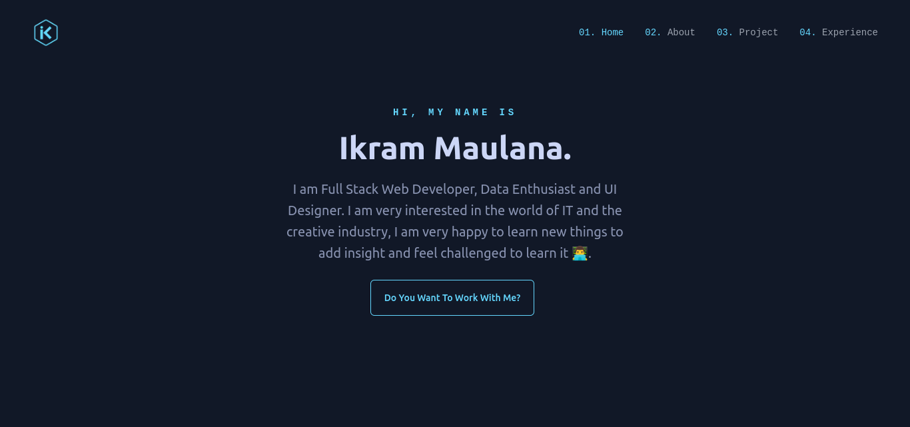

# Neon Portfolio (No Longer Maintained)

This is a portfolio website with a neon theme. It is built with Next.js and Tailwind CSS.

- Live example hosted on Vercel: [https://neon-portfolio.ikrammaulana.my.id/](https://neon-portfolio.ikrammaulana.my.id/)



## 🖥️ Running Locally

1. Clone this repository

   ```bash
   git clone https://github.com/Ikram-Maulana/neon-portfolio.git
   ```

2. Install dependencies

   ```bash
   cd neon-portfolio
   npm install
   ```

3. Start the development server

   ```bash
   npm run dev
   ```

4. Open [http://localhost:3000](http://localhost:3000) with your browser to see the result

## 🚀 Deploy on Vercel

1. Fork this repository

2. Create new project on [Vercel](https://vercel.com/)

3. Connect your repository to Vercel

4. Deploy your project
